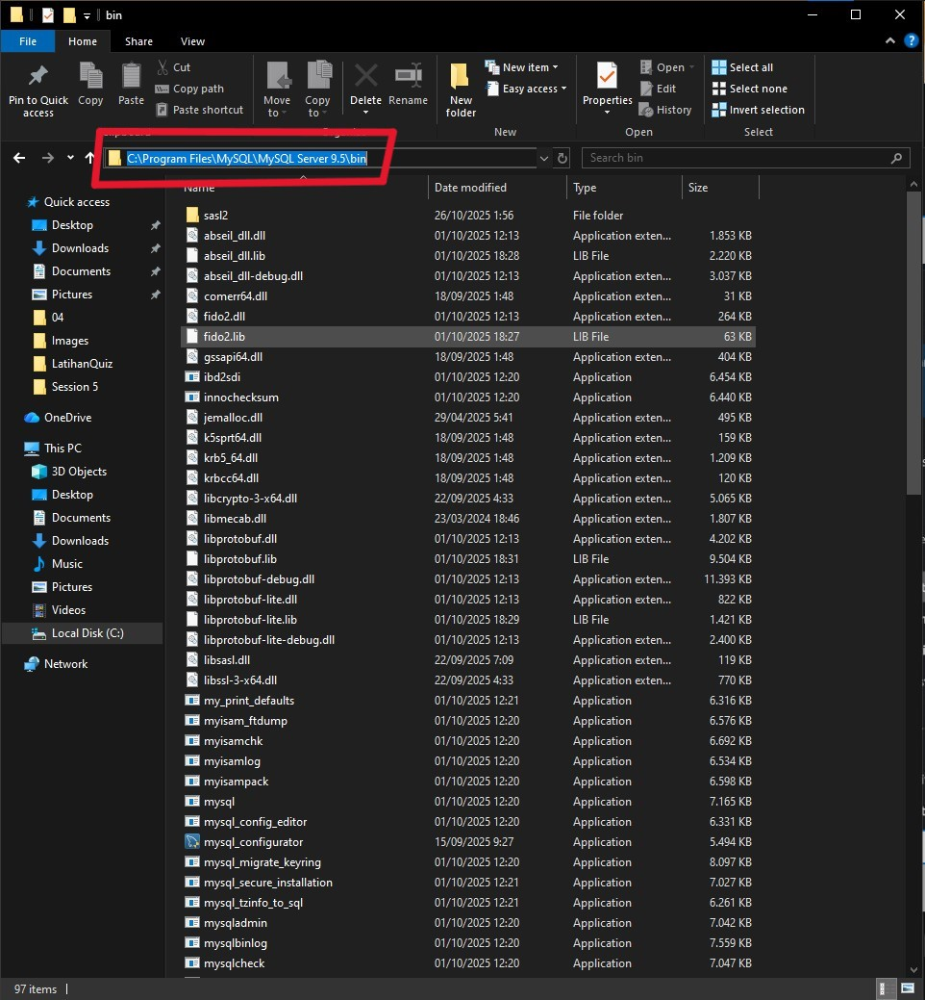
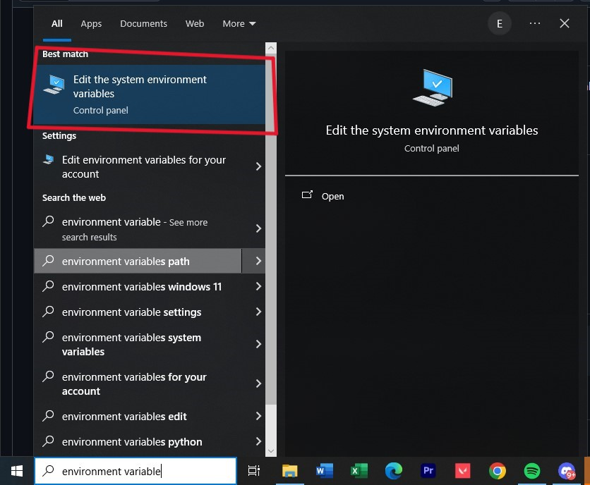
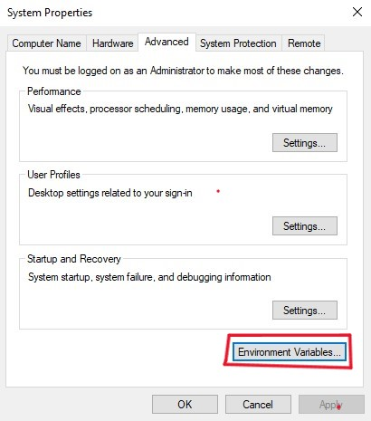
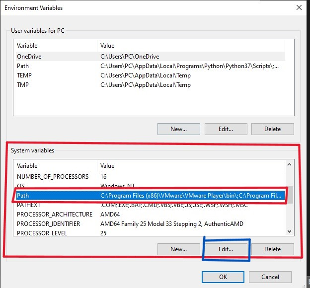
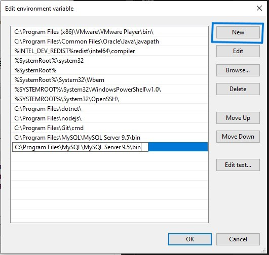

# construction-material-database
A database project that transforms a construction material submission form into a fully normalized MySQL database system for efficient project data management.

# 📘 Overview

This project demonstrates how to:
- Analyze a real-world form and identify redundant/unstructured data.
- Apply normalization (UNF → 1NF → 2NF → 3NF) to structure the data.
- Build a relational database using MySQL.
- Present the entire workflow through report and presentation files.

## 1. 🧠 Clone the Repository

```bash
git clone https://github.com/<edricemerson>/<construction-material-database>.git
cd <construction-material-database>
```

## 2. 💻 Set up VS Code + MySQL Shell / CLI
### Downloading required tools
| 🛠️ Tool | 💡 Purpose | 🔗 Download |
|----------|-------------|-------------|
| [**VS Code**](https://code.visualstudio.com) | Code editor for writing and running SQL or web projects. | [Download](https://code.visualstudio.com) |
| [**MySQL Server**](https://dev.mysql.com/downloads/mysql/) | Database engine that runs your SQL scripts. | [Download](https://dev.mysql.com/downloads/mysql/) |
| [**MySQL Shell / Command Line**](https://dev.mysql.com/downloads/mysql/) | Used to execute SQL commands and connect to your MySQL Server. *(Included automatically when you install MySQL)* | [Download](https://dev.mysql.com/downloads/mysql/) |

### Verify MySQL Installation
Open a terminal (or VS Code terminal) and run:
```bash
mysql --version
```

### ✅ If you see a version number like this you are up to date go to Open MySQL from VS Code Terminal:
```bash
mysql  Ver 8.0.xx for Win64 on x86_64 (MySQL Community Server)
```


---

### ❌ If you see 'mysql' is not recognized... while running
```bash
mysql --version
```
<details>
  <summary style=""><h3>How To Fix It ✅ (Windows Only)</h3></summary>
  
### 1️⃣Open File Explorer
### Go to one of these common paths and copy the path folder for later use:
```bash
C:\Program Files\MySQL\MySQL Server 8.0\bin
```
or
```bash
C:\Program Files (x86)\MySQL\MySQL Server 8.0\bin
```


### 2️⃣Search Environment Variable in Windows search bar and press it



### 3️⃣Click Environment Variables...



### 4️⃣See System variables' Box , Click the Path      C:\ProgramFiles..... 
### then Click Edit



### 5️⃣Click New and Paste the path folder from the first step

```bash
C:\Program Files\MySQL\MySQL Server 8.0\bin
```

```bash
C:\Program Files (x86)\MySQL\MySQL Server 8.0\bin
```



### FINISHED!!!
</details>


### Open MySQL from VS Code Terminal
Open your project folder in VS Code.
Open the integrated terminal (Ctrl + ~).
Run:
```bash
mysql -u root -p #password is the password you make when you download MySQL for the first time
```

If it's says
```bash
Welcome to the MySQL monitor.  Commands end with ; or \g.
Your MySQL connection id is 13
Server version: 9.5.0 MySQL Community Server - GPL

Copyright (c) 2000, 2025, Oracle and/or its affiliates.

Oracle is a registered trademark of Oracle Corporation and/or its
affiliates. Other names may be trademarks of their respective
owners.

Type 'help;' or '\h' for help. Type '\c' to clear the current input statement.
```

### You have finished setting it up!!

## 3. 🧾 Identifying every data in F007_Formulir Pengajuan Contoh Material.pdf 
| No. | Column Name | Description | Source Field in Form | Match |
|:--:|:-------------------------|:----------------------|:--------------------------------|:--:|
| 1 | **ID Pekerjaan** | Unique ID to distinguish each project record. | *(Database key – not shown in form)* | ✅ |
| 2 | **Pemilik Proyek** | The project owner responsible for the work. | “Pemilik Proyek” | ✅ |
| 3 | **Proyek** | The name or type of project (e.g., “Gedung A”). | “Proyek” | ✅ |
| 4 | **Paket Pekerjaan** | Specific work package within a project (e.g., “Struktur Lantai”). | “Paket / Pek.” | ✅ |
| 5 | **No Pengajuan** | Unique number identifying a material request. | “No.” | ✅ |
| 6 | **Nama Kontraktor** | Contractor company executing the project. | “Nama Kontraktor” | ✅ |
| 7 | **Tanggal Pengajuan** | Date the material was proposed. | “Tanggal Pengajuan” | ✅ |
| 8 | **Nama Bahan** | Name of the material requested. | “Nama Contoh Bahan / Material” | ✅ |
| 9 | **Nama Supplier** | Supplier providing the material. | “Nama Supplier” | ✅ |
| 10 | **Kode Material** | Unique code assigned to each material. | “Kode Bahan / Material” | ✅ |
| 11 | **Spesifikasi Diajukan** | Proposed material specifications from contractor. | “Spesifikasi Diajukan (Uraian Produk / Type)” | ✅ |
| 12 | **Spesifikasi Kontrak** | Approved specifications per project contract. | “Spesifikasi Kontrak (Produk / Type)” | ✅ |
| 13 | **Referensi** | Supporting references such as drawings or standards. | “Referensi (No. Gambar / RKS / Lain-lain)” | ✅ |
| 14 | **Lokasi** | Work location or area where material is used. | “Lokasi Pekerjaan (Ruang / Lantai)” | ✅ |
| 15 | **Lampiran** | Availability of attachments (sample, brochure, test result). | “Lampiran (Contoh Material / Brosur / Hasil Tes)” | ✅ |

### We stopped sampling the form after the **Lampiran** section because the remaining parts of the form such as **material evaluation** and **worker performance evaluation** are related to **future project assessment** activities, not the **material submission process**

<details>
  <summary style=""><h3>Additional Information about Data Anomalies ⚠️</h3></summary>
  
  ## 🧠 Understanding Data Anomalies

A **data anomaly** is an inconsistency or error that appears in an unnormalized database.  
It happens when one large table tries to store too many types of information at once — for example,  
mixing project, material, and supplier data in a single table.

There are **three major types** of anomalies:

| Type | Description |
|------|--------------|
| 🧩 **Insertion Anomaly** | When new data can’t be added without adding unrelated data. |
| 🔄 **Update Anomaly** | When a single update must be done in multiple rows. |
| ❌ **Deletion Anomaly** | When deleting one record removes other valuable data. |

---

## 🧩 1️⃣ Insertion Anomaly  

### 💡 Problem  
You can’t insert certain data unless other information exists first.

### 🧠 Example  
If you want to add a new **Supplier** (e.g., `PT Sumber Makmur`) but that supplier hasn’t yet provided materials for any project,  
the unnormalized database won’t allow the insertion — because the **ID_Pekerjaan** or **Kode_Material** fields would be empty.

| ID_Pekerjaan | Proyek | Kode_Material | Nama_Supplier |
|---------------|---------|----------------|----------------|
| P001 | Gedung A | M001 | PT Konstruksi Jaya |
| ❌ *(null)* | *(null)* | *(null)* | PT Sumber Makmur |

✅ **After normalization:**  
Suppliers are stored separately in the **Supplier** table.  
You can add `PT Sumber Makmur` without linking it to any project yet.

---

## 🔄 2️⃣ Update Anomaly  

### 💡 Problem  
Updating one piece of information requires multiple edits, which may cause inconsistency.

### 🧠 Example  
If the contractor **PT Konstruksi Jaya** changes its name to **PT Konstruksi Jaya Indonesia**,  
you’d have to update it in every record where it appears.  
If one row is missed, your data becomes inconsistent.

| ID_Pekerjaan | Proyek | Nama_Kontraktor |
|---------------|---------|----------------|
| P001 | Gedung A | PT Konstruksi Jaya |
| P002 | Gedung B | PT Konstruksi Jaya |
| ❌ P003 | Gedung C | *(not updated)* PT Konstruksi Jaya |

✅ **After normalization:**  
Contractor information is stored once in the **Pekerjaan** or **Kontraktor** table and referenced using foreign keys.  
Updating one record automatically reflects across all related projects.

---

## ❌ 3️⃣ Deletion Anomaly  

### 💡 Problem  
Deleting a record removes other important data unintentionally.

### 🧠 Example  
If project **P001 – Gedung A** is deleted, all linked data such as **materials** and **suppliers** may also be deleted —  
even though those suppliers are still relevant for other projects.

| ID_Pekerjaan | Proyek | Kode_Material | Nama_Supplier |
|---------------|---------|----------------|----------------|
| P001 | Gedung A | M001 | PT Konstruksi Jaya |
| ❌ Delete → | *(All linked supplier & material info lost)* | |
</details>

## 4. 🧾 Normalization to prevent anomalies

This document explains the **normalization process** from **UNF (Unnormalized Form)** to **3NF (Third Normal Form)**  
for the *Formulir Pengajuan Contoh Material* dataset.  
Each step removes redundancy and improves the structure of the database.

You can download the excel of the finished product after normalization at [Table Normalisasi.xlsx](https://github.com/edricemerson/construction-material-database/blob/main/Tabel%20Normalisasi.xlsx)

or see it in this **Table** Dropdown

<details>
  <summary style=""><h3>Table</h3></summary>
  
## 🧱 UNF – Unnormalized Form  

The **UNF (Unnormalized Form)** is the raw dataset that contains **repeated and grouped data** in a single table.  
All material, project, supplier, and attachment data are stored together, causing **redundancy** and **anomalies**.

| ID Pekerjaan | Pemilik Proyek | Proyek | Paket Pekerjaan | No. Pengajuan | Nama Kontraktor | Tanggal Pengajuan | Nama Bahan | Nama Supplier | Kode Material | Spesifikasi Diajukan | Spesifikasi Kontrak | Referensi | Lokasi | Lampiran |
|---------------|----------------|---------|------------------|----------------|------------------|--------------------|-------------|----------------|----------------|----------------------|---------------------|-------------|-----------|------------|
| 001 | Budi Susanto | Pembangunan Gedung A | Struktur Lantai | 001/PK/A | PT Konstruksi Jaya | 2024-12-11 | Beton Pracetak | PT Beton Emas | Beton_001 | Produk: Beton, Tipe: K-300, Kode: BTK300 | Produk: Beton, Tipe: K-300 | Gambar: 11, RKS: 12 | Lantai 1 | Contoh: Ada, Brosur: Ada, Hasil Test: Ada |
| 002 | Bambang Sudono | Renovasi Kantor Sudirman | Interior | 002/PK/B | PT Interior Maju | 2024-12-12 | Papan MDF | PT Kayu Lestari | MDF_002 | Produk: MDF, Tipe: Premium, Kode: MDF400 | Produk: MDF, Tipe: Premium | Gambar: 12, RKS: 13 | Meeting | Contoh: Tidak Ada, Brosur: Ada, Hasil Test: Ada |
| 003 | Bayu Alfari | Pembangunan Mall | Struktur Atap | 003/PK/C | PT Baja Indonesia | 2024-12-13 | Baja WF | PT Baja Prima | Baja_003 | Produk: Baja, Tipe: 100m, Kode: BAJA300 | Produk: Baja, Tipe: 100m | Gambar: 13, RKS: 14 | Basement | Contoh: Ada, Brosur: Tidak Ada, Hasil Test: Ada |
| 004 | Asep Budiman | Pembangunan Komplek | Tembok | 004/PK/D | PT Rumah Idaman | 2024-12-14 | Bata Putih | PT Bata Indah | Bata_004 | Produk: Bata, Tipe: Putih, Kode: BT100 | Produk: Bata, Tipe: Putih | Gambar: 14, RKS: 15 | Kamar | Contoh: Tidak Ada, Brosur: Ada, Hasil Test: Tidak Ada |
| 005 | Jojo Widodo | Jembatan Layang | Struktur | 005/PK/E | PT Infrastruktur Abadi | 2024-12-15 | Aspal Polimer | PT Aspal Mulia | Aspal_005 | Produk: Aspal, Tipe: Polimer, Kode: ASP600 | Produk: Aspal, Tipe: Polimer | Gambar: 15, RKS: 16 | Jalan Raya | Contoh: Ada, Brosur: Tidak Ada, Hasil Test: Tidak Ada |

🧩 **Problem:** Data redundancy and multiple values per column (e.g., grouped "Lampiran" data).  

---

## 🔹 1NF – First Normal Form  

**1NF** ensures that all fields contain **atomic values** (no repeating groups).  
Multi-valued attributes like *Lampiran* and *Spesifikasi* are separated into individual columns.

| ID Pekerjaan | Pemilik Proyek | Proyek | Paket Pekerjaan | No. Pengajuan | Nama Kontraktor | Tanggal Pengajuan | Nama Bahan | Nama Supplier | Kode Material | Spesifikasi Produk | Spesifikasi Tipe | Spesifikasi Kode | Referensi Gambar | Referensi RKS | Lokasi | Lampiran Contoh | Lampiran Brosur | Lampiran Hasil Test |
|---------------|----------------|---------|------------------|----------------|------------------|--------------------|-------------|----------------|----------------|--------------------|------------------|------------------|------------------|----------------|-----------|------------------|------------------|------------------|
| 001 | Budi Susanto | Pembangunan Gedung A | Struktur Lantai | 001/PK/A | PT Konstruksi Jaya | 2024-12-11 | Beton Pracetak | PT Beton Emas | Beton_001 | Beton | K-300 | BTK300 | 11 | 12 | Lantai 1 | Ada | Ada | Ada |
| 002 | Bambang Sudono | Renovasi Kantor Sudirman | Interior | 002/PK/B | PT Interior Maju | 2024-12-12 | Papan MDF | PT Kayu Lestari | MDF_002 | MDF | Premium | MDF400 | 12 | 13 | Meeting | Tidak Ada | Ada | Ada |
| 003 | Bayu Alfari | Pembangunan Mall | Struktur Atap | 003/PK/C | PT Baja Indonesia | 2024-12-13 | Baja WF | PT Baja Prima | Baja_003 | Baja | 100m | BAJA300 | 13 | 14 | Basement | Ada | Tidak Ada | Ada |
| 004 | Asep Budiman | Pembangunan Komplek | Tembok | 004/PK/D | PT Rumah Idaman | 2024-12-14 | Bata Putih | PT Bata Indah | Bata_004 | Bata | Putih | BT100 | 14 | 15 | Kamar | Tidak Ada | Ada | Tidak Ada |
| 005 | Jojo Widodo | Jembatan Layang | Struktur | 005/PK/E | PT Infrastruktur Abadi | 2024-12-15 | Aspal Polimer | PT Aspal Mulia | Aspal_005 | Aspal | Polimer | ASP600 | 15 | 16 | Jalan Raya | Ada | Tidak Ada | Tidak Ada |

✅ **Result:** All values are atomic; no repeating or grouped attributes remain.

---

## 🔸 2NF – Second Normal Form  

**2NF** removes **partial dependencies** — all non-key attributes depend on the entire primary key.  
We separate **Pekerjaan** (Project) and **Material** tables to reduce redundancy.

### 🏗️ Table: Pekerjaan

| ID Pekerjaan | Pemilik Proyek | Proyek | Paket Pekerjaan | No. Pengajuan | Nama Kontraktor | Tanggal Pengajuan | Lokasi | Referensi Gambar | Referensi RKS | Lampiran Contoh | Lampiran Brosur | Lampiran Hasil Test |
|---------------|----------------|---------|------------------|----------------|------------------|--------------------|-----------|------------------|----------------|------------------|------------------|------------------|
| 001 | Budi Susanto | Pembangunan Gedung A | Struktur Lantai | 001/PK/A | PT Konstruksi Jaya | 2024-12-11 | Lantai 1 | 11 | 12 | Ada | Ada | Ada |
| 002 | Bambang Sudono | Renovasi Kantor Sudirman | Interior | 002/PK/B | PT Interior Maju | 2024-12-12 | Meeting | 12 | 13 | Tidak Ada | Ada | Ada |
| 003 | Bayu Alfari | Pembangunan Mall | Struktur Atap | 003/PK/C | PT Baja Indonesia | 2024-12-13 | Basement | 13 | 14 | Ada | Tidak Ada | Ada |
| 004 | Asep Budiman | Pembangunan Komplek | Tembok | 004/PK/D | PT Rumah Idaman | 2024-12-14 | Kamar | 14 | 15 | Tidak Ada | Ada | Tidak Ada |
| 005 | Jojo Widodo | Jembatan Layang | Struktur | 005/PK/E | PT Infrastruktur Abadi | 2024-12-15 | Jalan Raya | 15 | 16 | Ada | Tidak Ada | Tidak Ada |

### 🧱 Table: Material

| Kode Material | Nama Bahan | Nama Supplier | Spesifikasi Produk | Spesifikasi Tipe | Spesifikasi Kode |
|----------------|-------------|----------------|--------------------|------------------|------------------|
| Beton_001 | Beton Pracetak | PT Beton Emas | Beton | K-300 | BTK300 |
| MDF_002 | Papan MDF | PT Kayu Lestari | MDF | Premium | MDF400 |
| Baja_003 | Baja WF | PT Baja Prima | Baja | 100m | BAJA300 |
| Bata_004 | Bata Putih | PT Bata Indah | Bata | Putih | BT100 |
| Aspal_005 | Aspal Polimer | PT Aspal Mulia | Aspal | Polimer | ASP600 |

✅ **Result:** Each table now depends fully on its own primary key.

---

## 🔹 3NF – Third Normal Form  

**3NF** removes **transitive dependencies** by ensuring non-key attributes depend only on the key.  
Relationships between `Pekerjaan`, `Material`, `Lampiran`, and `Lokasi` are separated.

### 🧩 Table: Pekerjaan

| ID Pekerjaan | Pemilik Proyek | Proyek                   | Paket Pekerjaan | No. Pengajuan | Nama Kontraktor        | Tanggal Pengajuan | Kode Material | Lokasi Fisik      |
| ------------ | -------------- | ------------------------ | --------------- | ------------- | ---------------------- | ----------------- | ------------- | ----------------- |
| 001          | Budi Susanto   | Pembangunan Gedung A     | Struktur Lantai | 001/PK/A      | PT Konstruksi Jaya     | 2024-12-11        | Beton_001     | Ruang: Lantai 1   |
| 002          | Bambang Sudono | Renovasi Kantor Sudirman | Interior        | 002/PK/B      | PT Interior Maju       | 2024-12-12        | MDF_002       | Ruang: Meeting    |
| 003          | Bayu Alfari    | Pembangunan Mall         | Struktur Atap   | 003/PK/C      | PT Baja Indonesia      | 2024-12-13        | Baja_003      | Ruang: Basement   |
| 004          | Asep Budiman   | Pembangunan Komplek      | Tembok          | 004/PK/D      | PT Rumah Idaman        | 2024-12-14        | Bata_004      | Ruang: Kamar      |
| 005          | Jojo Widodo    | Jembatan Layang          | Struktur        | 005/PK/E      | PT Infrastruktur Abadi | 2024-12-15        | Aspal_005     | Ruang: Jalan Raya |

### 🧱 Table: Material

| Kode Material | Nama Bahan     | Nama Supplier   | Spesifikasi Produk | Spesifikasi Tipe | Spesifikasi Kode |
| ------------- | -------------- | --------------- | ------------------ | ---------------- | ---------------- |
| Beton_001     | Beton Pracetak | PT Beton Emas   | Beton              | K-300            | BTK300           |
| MDF_002       | Papan MDF      | PT Kayu Lestari | MDF                | Premium          | MDF400           |
| Baja_003      | Baja WF        | PT Baja Prima   | Baja               | 100m             | BAJA300          |
| Bata_004      | Bata Putih     | PT Bata Indah   | Bata               | Putih            | BT100            |

### 📍 Table: Lokasi

| Proyek                   | Paket Pekerjaan | Lokasi            |
| ------------------------ | --------------- | ----------------- |
| Pembangunan Gedung A     | Struktur Lantai | Ruang: Lantai 1   |
| Renovasi Kantor Sudirman | Interior        | Ruang: Meeting    |
| Pembangunan Mall         | Struktur Atap   | Ruang: Basement   |
| Pembangunan Komplek      | Tembok          | Ruang: Kamar      |
| Jembatan Layang          | Struktur        | Ruang: Jalan Raya |

### 📄 Table: Lampiran

| ID Pekerjaan | Lampiran Contoh | Lampiran Brosur | Lampiran Hasil Test |
| ------------ | --------------- | --------------- | ------------------- |
| 001          | Ada             | Ada             | Ada                 |
| 002          | Tidak ada       | Ada             | Ada                 |
| 003          | Ada             | Tidak ada       | Ada                 |
| 004          | Tidak ada       | Ada             | Tidak ada           |
| 005          | Ada             | Ada             | Ada                 |

</details>

## 5. 💻 Creating Database and Inserting Data into MySQL

Follow these steps to create a database, tables, and insert data using **VS Code** and **MySQL CLI**.

---

### **Step 1: Open MySQL in VS Code**

Open the terminal in VS Code and type:

```bash
mysql -u root -p
```

Enter the password you set when installing MySQL.

Verify you are in MySQL:

```bash
SHOW DATABASES;
```

### **Step 2: Create a New Database**

```bash
CREATE DATABASE Form_DB;
SHOW DATABASES;
USE Form_DB;
```
Step 3: Create Tables and Insert Data

You can use the SQL Syntaxes provided from [FormSQL](https://github.com/edricemerson/construction-material-database/blob/main/Kelompok%207%20AOL%20DB.sql)

# MySQL CLI Syntaxes

| Category | Command / Syntax | Description | Example |
|----------|-----------------|-------------|---------|
| **Database** | `SHOW DATABASES;` | List all databases | `SHOW DATABASES;` |
| | `CREATE DATABASE db_name;` | Create a new database | `CREATE DATABASE projectdb;` |
| | `DROP DATABASE db_name;` | Delete a database permanently | `DROP DATABASE Form_DB;` |
| | `USE db_name;` | Switch to a database | `USE projectdb;` |
| | `SELECT DATABASE();` | Show current database | `SELECT DATABASE();` |
| **Table Management** | `SHOW TABLES;` | List all tables in current database | `SHOW TABLES;` |
| | `DESCRIBE table_name;` | Show table structure | `DESCRIBE Pekerjaan;` |
| | `CREATE TABLE table_name (...);` | Create a table | `CREATE TABLE Material (...);` |
| | `DROP TABLE table_name;` | Delete a table | `DROP TABLE Lampiran;` |
| | `ALTER TABLE table_name ADD column_name datatype;` | Add a new column | `ALTER TABLE Pekerjaan ADD Budget DECIMAL(10,2);` |
| | `ALTER TABLE table_name DROP COLUMN column_name;` | Remove a column | `ALTER TABLE Material DROP COLUMN Spesifikasi_Kode;` |
| **Data Manipulation** | `INSERT INTO table_name (col1, col2) VALUES (...);` | Insert a row | `INSERT INTO Pekerjaan VALUES (1,'Budi','Gedung A',...);` |
| | `UPDATE table_name SET col1=value WHERE condition;` | Update existing data | `UPDATE Pekerjaan SET Lokasi='Lantai 2' WHERE ID_Pekerjaan=1;` |
| | `DELETE FROM table_name WHERE condition;` | Delete rows | `DELETE FROM Lampiran WHERE ID_Pekerjaan=3;` |
| | `SELECT * FROM table_name;` | Select all rows | `SELECT * FROM Material;` |
| | `SELECT col1, col2 FROM table_name WHERE condition;` | Select specific columns | `SELECT Nama_Bahan, Nama_Supplier FROM Material;` |
| **Filtering & Conditions** | `WHERE column = value` | Filter rows | `SELECT * FROM Pekerjaan WHERE Lokasi='Lantai 1';` |
| | `WHERE column LIKE '%pattern%'` | Partial match | `SELECT * FROM Pekerjaan WHERE Proyek LIKE '%Mall%';` |
| | `WHERE column IN (value1,value2)` | Match multiple values | `SELECT * FROM Material WHERE Nama_Bahan IN ('Beton','Baja');` |
| | `WHERE column BETWEEN val1 AND val2` | Filter range | `SELECT * FROM Pekerjaan WHERE Tanggal_Pengajuan BETWEEN '2024-12-11' AND '2024-12-15';` |
| | `WHERE column IS NULL / IS NOT NULL` | Check null values | `SELECT * FROM Lampiran WHERE Lampiran_Brosur IS NULL;` |
| | `AND / OR / NOT` | Combine conditions | `SELECT * FROM Pekerjaan WHERE Lokasi='Lantai 1' AND Paket_Pekerjaan='Struktur';` |
| **Aggregation & Grouping** | `COUNT(column)` | Count rows | `SELECT COUNT(*) FROM Pekerjaan;` |
| | `SUM(column)` | Sum values | `SELECT SUM(Budget) FROM Pekerjaan;` |
| | `AVG(column)` | Average | `SELECT AVG(Budget) FROM Pekerjaan;` |
| | `MAX(column)` | Maximum | `SELECT MAX(Tanggal_Pengajuan) FROM Pekerjaan;` |
| | `MIN(column)` | Minimum | `SELECT MIN(Tanggal_Pengajuan) FROM Pekerjaan;` |
| | `GROUP BY column` | Group rows | `SELECT Paket_Pekerjaan, COUNT(*) FROM Pekerjaan GROUP BY Paket_Pekerjaan;` |
| | `HAVING condition` | Filter grouped rows | `SELECT Paket_Pekerjaan, COUNT(*) FROM Pekerjaan GROUP BY Paket_Pekerjaan HAVING COUNT(*)>1;` |
| **Joins** | `INNER JOIN` | Match rows in both tables | `SELECT * FROM Pekerjaan P JOIN Material M ON P.Kode_Material=M.Kode_Material;` |
| | `LEFT JOIN` | All rows from left + matches from right | `SELECT * FROM Pekerjaan P LEFT JOIN Lampiran L ON P.ID_Pekerjaan=L.ID_Pekerjaan;` |
| | `RIGHT JOIN` | All rows from right + matches from left | `SELECT * FROM Lampiran L RIGHT JOIN Pekerjaan P ON L.ID_Pekerjaan=P.ID_Pekerjaan;` |
| **Views** | `CREATE VIEW view_name AS SELECT ...;` | Create a virtual table | `CREATE VIEW Pekerjaan_Material AS SELECT P.Proyek, M.Nama_Bahan FROM Pekerjaan P JOIN Material M ON P.Kode_Material=M.Kode_Material;` |
| | `SELECT * FROM view_name;` | Query a view | `SELECT * FROM Pekerjaan_Material;` |
| **Backup & Restore** | `mysqldump -u root -p db_name > backup.sql` | Backup a database | `mysqldump -u root -p projectdb > projectdb_backup.sql` |
| | `mysql -u root -p db_name < backup.sql` | Restore a database | `mysql -u root -p projectdb < projectdb_backup.sql` |
| **Miscellaneous** | `SHOW CREATE TABLE table_name;` | See table creation SQL | `SHOW CREATE TABLE Pekerjaan;` |
| | `EXPLAIN SELECT ...;` | Show query execution plan | `EXPLAIN SELECT * FROM Pekerjaan;` |
| | `DESCRIBE table_name;` | Show table columns | `DESCRIBE Material;` |

